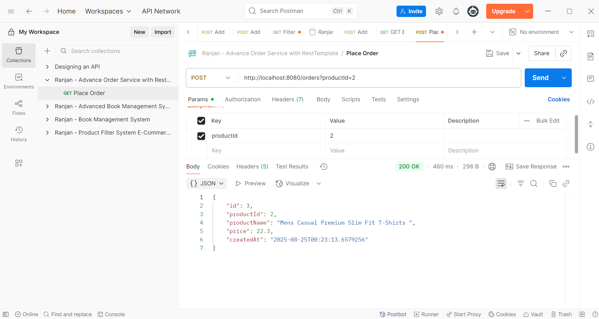

# 🛒 Spring Boot Order API with H2 and External Product Check

This is a Spring Boot REST API that simulates placing an order. Before creating an order, it checks product availability from a **free public API** (`https://fakestoreapi.com`). If the product is available, the order is saved in an **in-memory H2 database**.

---

## ✅ Features

- 📦 Fetch product details from a 3rd-party API (with RestTemplate)
- ✅ Place an order if the product is available
- ❌ Return "Product not available" if out of stock
- 💾 Save order data into H2 in-memory DB
- 🔁 Uses `RestTemplate` for HTTP calls
- 🔧 Clean separation between Controller and Service layers
- ⚠️ Simple exception handling

---

# Test Evidences:

- APIs on Swagger

 

- Postman Request

 

- Postman Request (for GET filter and pagination support: http://localhost:8080/books/page?page=0&size=5&sortBy=title)
 
 

- H2 DB console

 

## 🚀 Getting Started

### 🔧 Prerequisites

- Java 17+
- Spring Boot 3.x
- Spring Web
- Spring Data JPA
- H2 Database
- Spring Profiles
- Lombok (optional)
- Springdoc OpenAPI (Swagger UI)

### 📌 Special Features
- @Transactional for atomic DB updates
- @Profile for environment-specific beans (dev / prod)
- @Qualifier to resolve multiple implementations
- @Scheduled for periodic tasks
- @Value, @PostConstruct, @PreDestroy for lifecycle & config
- H2 console: http://localhost:8080/h2-console

### ▶️ Run the App

mvn spring-boot:run

## API Endpoints

**Method**	**Endpoint**	**Description**
- GET	    /books	    (Get all books)
- GET	    /books/{id}	(Get book by ID)
- POST	    /books	    (Add new book)
- PUT	    /books/{id}	(Update book by ID)
- DELETE	/books/{id}	(Delete book by ID)
- GET	    /books/page	(Paginated books)

## License
This project is licensed under the MIT License.

## You have some query?
If you have some query, feel free to connect with me here -- [Ranjan Kumar Mandal](https://www.linkedin.com/in/ranjan-kumar-m-818367158/)
